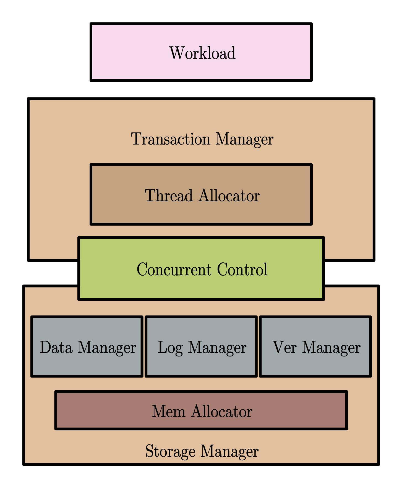

# Introduction

This documentation is about how I design and organize all codes.

To avoid unnecessary running-time overhead but implement polymorphism, I try to use static polymorphism, which will finish as much work during compiling as it can.

As complex it is, static polymorphism use obscure combination of templates. I expect this architecture to be **understandable**, **effective** and **scalable**, because it is so excruciating to read code in a lot styles, e.g. many new works on DBX1000.

Now I'm going to present the design principle of this code.


# File Organization

We construct the whole project by CMake.

Every module consists of two directories: `include` and `src`. The former is used to store all headers and the latter stores source files.

I know directories **src** are all empty now for I don’t like to separate definition and implementation, which is quite hard for us to skim and understand all the codes smoothly. But it is left for someone like that or some input libraries organized in that way.

There is another thing: why I make a concurrent_control directory in the include of module directory concurrent_control. I know it may be confusing and seems to be redundant. The reason I do this is that we can include this file by code `#include <concurrent_control/occ/occ.h>`, which clearly present every module this file belongs to, and will not collapse with files with the same same in another module.

So the file structure will be:

```
Project
 |
 | -- include
 | -- src
 | -- module_1
	   | -- include
	   		  module_1
	   		   | -- a_header.h
	   | -- src
	   		  module_1
	   	       | -- a_header.cpp
	   | -- CMakeList.txt
 | -- module_2
 	   | -- include
 	   	      module_2
	   		   | -- b_header.h
	   		  module_app
	   		   | -- c_header.h
	   | -- src
 	   	      module_2
	   		   | -- b_header.cpp
	   		  module_app
	   		   | -- c_header.cpp
	   | -- CMakeList.txt
 | -- CMakeLists.txt
```


# Principle


## Architecture

Many works mix all layers up and label themselves as ‘scalable’. It is quiet awful, so I try to detach each layer clearly. Then every part of this code can be copied to another project without too much dependency (The module `util` is always needed for there are some global configuration and convenient tools).



- **Workload**

	The highest layer. I have implemented two kind of benchmark so far: **YCSB** and **TPCC**

- **Transaction Manager**

	It is responsible for allocation of threads and how to dispatch tasks to each thread. For testing, there are also **time counter** limiting testing time and **exception handler**.

- **Concurrent Control**

	The concurrent control layer connect transaction manager and storage manager. Work just as protocol, it regulate threads when and how to write/read something by interface supplied by storage manger. 

- **Storage Manager**

	Containing **Data Manager**, **Log Manager**, **Ver(sion) Manager**, It is charged with allocation of data, logs and versions. The distribution of memory allocated is transparent to upper layers, except for the **Linearization** of logs.


## Static Polymorphism

Every module has corresponding **enumeration** containing types of component implemented. And upper layer will gain the real component by class named `<name>Manager`.

To be detailed, for example, I've implemented two kinds of workload: YCSB and TPCC. So there is a enumeration:

```C++
enum class WorkloadType {
	YCSB,
	TPCC
}
```

Meanwhile, there are a manager providing details by given type:

```c++
template<WorkloadType workloadTp>
struct WorkloadManger {
    using Workload = void;
}

template<>
struct WorkloadManger<WorkloadType::YCSB> {
    using Workload = YCSB;
}

template<>
struct WorkloadManger {
    using Workload = TPCC;
}
```

Once we need to get the type of wokload we want:

```c++
using Workload = WorkloadManger<WorkloadType::YCSB>::Workload;

Workload workload;
auto transaction = workload.generate_transaction();
```

Then we don’t need to care about which parameter should be fill in which vacant, just let manager know the requisition and get type from it.

It is quite common for template to be more and more complicated as the project grows. Let’s look at how much work `GlobalConfig` has done for us:

```c++
// in global_config.h
template<
        WorkloadType WorkloadTp,
        IndexType DataIndexTp,
        ConcurrentControlType ConcurrentControlTp,
        TransactionManagerType TransactionManagerTp,
        ThreadBindStrategyType ThreadBindStrategyTp,
        StorageManagerType StorageManagerTp>
struct GlobalConfigManager {

    using WorkloadType        = workload::WorkloadManager<WorkloadTp>::Workload;

    using Key                 = WorkloadType::KeyType;

    using Workload            = WorkloadType;

    using DataTupleHeaderType = cc::ConcurrentControlBasicManager<ConcurrentControlTp, Workload>::DataTupleHeaderType;

    using IndexTupleType      = cc::ConcurrentControlBasicManager<ConcurrentControlTp, Workload>::IndexTupleType;

    using VersionHeaderType   = cc::ConcurrentControlBasicManager<ConcurrentControlTp, Workload>::VersionHeaderType;

    using StorageManager      = storage::StorageManagerManager<StorageManagerTp, Key, DataTupleHeaderType, IndexTupleType, DataIndexTp, VersionHeaderType>::StorageManager;

    using ConcurrentControl   = cc::ConcurrentControlManager<ConcurrentControlTp, Workload, StorageManager>::ConcurrentControl;

    using TransactionManager  = transaction::TransactionManagerManager<TransactionManagerTp, Workload, ConcurrentControl>::TransactionManager;

    static constexpr auto ThreadBindStrategy = ThreadBindStrategyTp;
    }
};
```

And what you need to do is to compose of the whole system by understandable enumeration:

```c++
// main.cpp
	/// Workload Configuration
	constexpr auto Workload = WorkloadType::YCSB_A;

	/// Index Configuration
	constexpr auto DataIndex = IndexType::BPTree;

	/// Concurrent control Configuration
	constexpr auto ConcurrentControl = ConcurrentControlType::EXPERIMENT;

	/// Transaction Configuration
	constexpr auto TransactionManager = TransactionManagerType::SimpleTransactionManager;

	/// Storage Manager Configuration
	constexpr auto StorageManager = StorageManagerType::VH_PMEMDATA_PMEMLOG;

	/// Strategy of thread binding
	constexpr ThreadBindStrategyType BindStrategy = ThreadBindStrategyType::NUMABind;

// Global Configuration
using GlobalConfig = GlobalConfigManager<
				Workload,
				DataIndex,
				ConcurrentControl,
				TransactionManager,
				BindStrategy,
				StorageManager>;
```

And get every type of component from `Global Config`

> Q: *Why don't I implement it in CRTP?*
> 
> A: I've tried it, but it seems to incur extra overheads, maybe caused by too deep call.
> I know that it can not only wrap them gracy, but constrain member functions.
> So I use concept to achieve that.

## Concept

This is a new characteristic in C++20, which can be used in many ways.

But I just use it in two kind of occasions.

-  **Interface Constrain**

	By dynamic polymorphism, we use `virtual` to ask classes implementing compulsory functions. But this is known for incurring extra overheads. 

	I add concept to the mentioned manager in every module to make sure every class exposed has implemented compulsory definitions, for example:

	```c++
	template<>
	struct WorkloadManager<WorkloadType::YCSB_A> {
	    using WorkloadConfig = YCSBConfig<YCSBConfigType::A>;
	
	    using Workload       = YCSB<WorkloadConfig>;
	
	    static_assert(WorkloadConcept<Workload>);
	};
	```

- **Interface Requisition**

	This is easy to understand, just as most usage, we use it in some template class to make sure the given template arguments is compatible.


